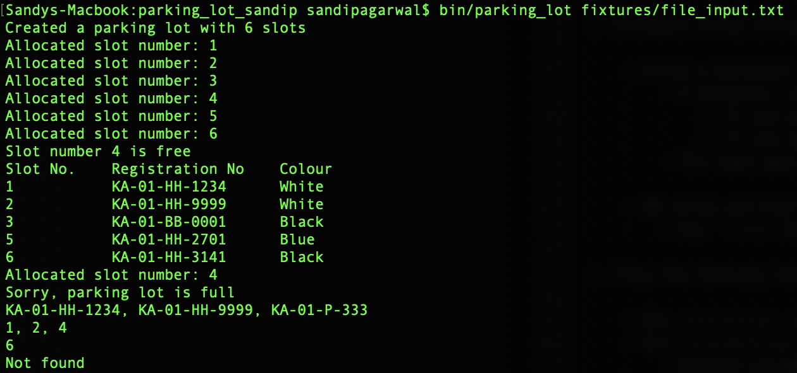

parking_lot
==============

Platform App for writing a game of parking lot in Flask.
==============

Author: [Sandip Agarwal](https://github.com/sandipagarwal)

Setup Steps
===========

1. Environment Setup

    * Create and Activate a virtual environment: `mkvirtualenv <env_name>`
        - Recommended python version: 2.7.12
        - For setting up virtual env and wrapper, please refer the following links:
            1. https://docs.python-guide.org/dev/virtualenvs/#lower-level-virtualenv
            2. https://virtualenv.pypa.io/en/latest/

    * Install the requirements by using command:
        * `pip install -r requirements.txt`

2. Database Setup (Development environment)

    * Setup a database (we are usign a SQLite DB for this project for quick setup)
        - A database `parking_lot.db` is being exported with the code base. You can use the same or create a new one (with a different name).
            1. If you want a new db with a different name, please change the name of the DB in config param `APP_DB`.
            2. If you want a new db with the same name, just delete `parking_lot.db`. The code would create a new for you.
        - The same applies for test DB. The database `parking_lot_test.db` is the test DB. Change `TEST_DB` for custom name of test DB.

    * DB setup and migrations:
        * Run `flask db upgrade`

3. Play the Parking lot game

    * Run `bin/setup` to install pip requirements globally and execute the test cases automatically.
    * Run `bin/parking_lot`
        - Without params to start the interactive session of the game
        - With a file path to run the game with inputs from the file

Some screenshots:
===========

